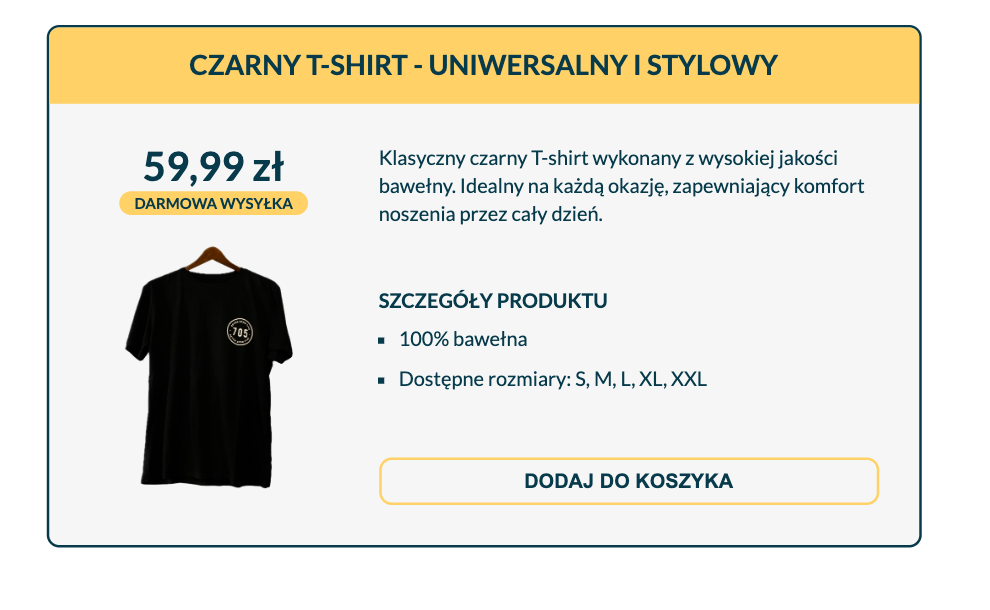
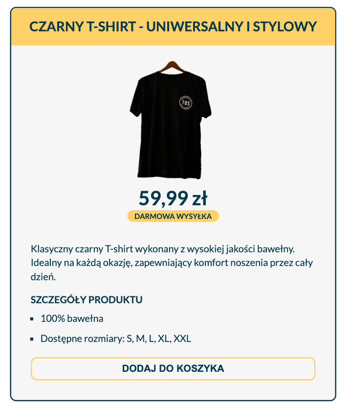
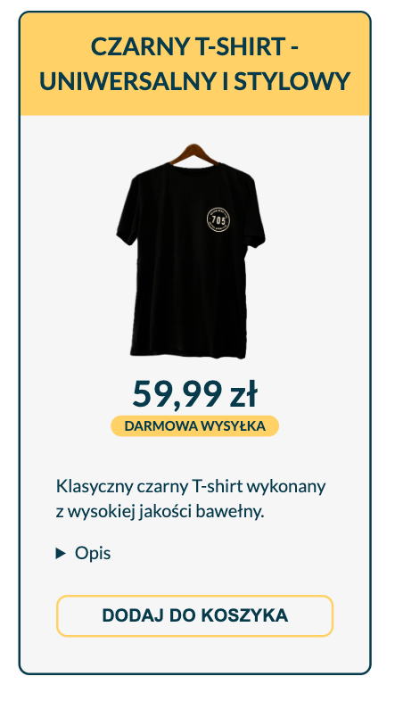

# Projekt - cwiczenie responsive web design
[Kliknij tutaj aby rozwiązać zadanie](https://githubbox.com/Publishing-School/css-cwiczenie-rwd)

Zadanie polega na dodaniu responywności dla karty produktu.

Rozwiązanie - pełna szerokość

Rozwiązanie - tablet

Rozwiązanie - smartfon
